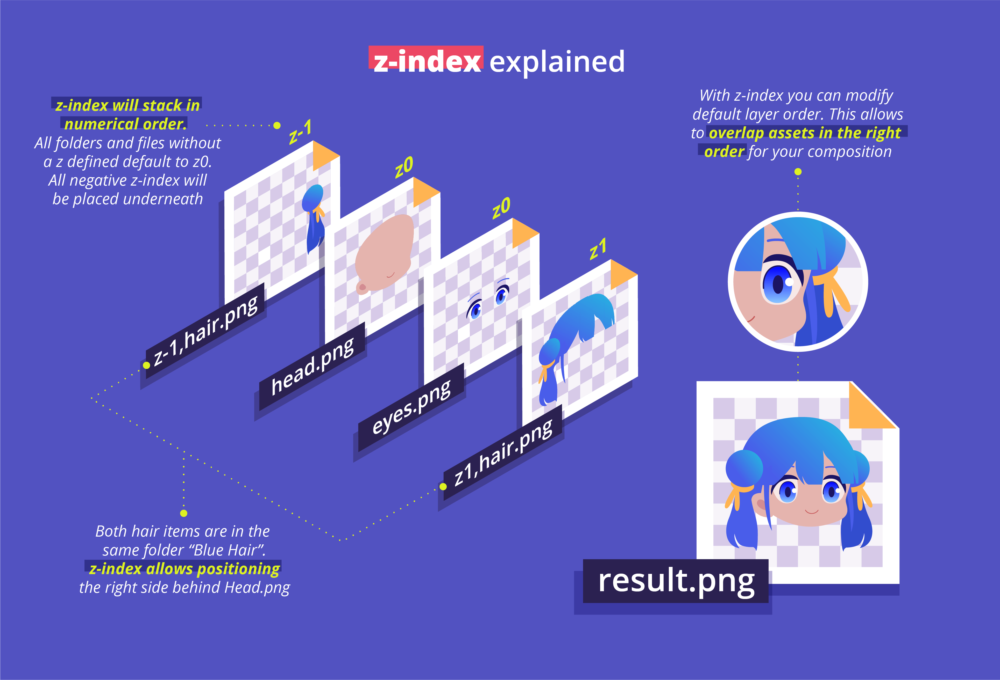

# z-index (layer order)

## Controlling stacking order



### Basic organization

Generally, layer order is defined by using `layersOrder` in config.js. However, when using nested folders, layer order defaults to alphanumeric sorting (0-9,a-z)

To manually define stacking order for sublayers (nested folders) use the `z#,` (`z` followed by a positive or negative number, followed bu a `,` comma) prefix for folder names and/or file names.

Example folders _inside_ a root folder.&#x20;

⚠️ **z-index does not work on "Root Layers", the layers listed in the `layersOrder` inside config.js**

⚠️ **If you are not seeing your negative z-index layers, be sure you do not have a background layer covering them! you may need to set backgrounds to a lower negative number.**

```
|- z-1,under layer
|-normal layer/
|-normal layer two/
|-- z3,OptionAlways On Top#50.png
|-z2,layer two/
```

 (1).png>)

Folders and files without a `z#,` prefix default to a z-index of `0`

If a file has a `z#,` prefix, and its parent folder(s) does as well, the **files z-index will be used,** allowing you to overwrite and define an individual's layer order.

<mark style="background-color:orange;">Layer order z-indexes are "global" meaning the index is relative to ALL OTHER z-indices defined in every folder/file</mark>

### Multiple layers for a single trait

In the case where a single trait needs to have one part of the image on top, and another layered below (see the Hair Example in the illustated diagram at the top of this document), use weighted subfolders with required folders inside.

The result will be the Hair, Front.png being stacked _normally,_ while Back.png will be send below all other layers (higher that negative one).

.png>)

## Advanced Usage

There are many cases where simple layers result in a tangle of options and incompatible layers Nested Layers and z-Index features of this application have all the answers that are needed.

Let's set up a simple scenario that will serve as the basis for understanding.

#### The Example Project Concept

Let's say we are building a basic 4-layers:

1. Background
2. Body
3. Hair
4. (optional) Hat

The Body has 2 basic options - each with 2 skin tones. So, in total, we have 4 possible Body options:

1. `Female 1`
2. `Female 2`
3. `Male 1`
4. `Male 2`

Futhermore, let's assume we have multiple hairstyles. The hairstyles are not shared between male/female, but are shared between both skin tones (eg, `Male Hair 1` can be on `Male 1` or `Male 2`, but can't be on any female)

Lastly, certain hats are only compatible with certain hairstyles. For this scenario, let's assume:

* `Male Hat 1` and `Male Hat 2` work with `Male Hair 1`
* `Male Hat 2` works with `Male Hair 2`
* There should be a chance for NO hat to be selected on either hair

For the sake of brevity, we will not consider hat options for the Females

#### Jump to the End Result

For those that like seeing the end result first, here is the final tree structure that supports this scenario. We will dig in section by section to further understand.

**NOTE:** The filenames and directories used here are not using "friendly" names and will either need to be overridden or changed to make the Metadata JSON files look right.

#### Contents of `layers`

```
.
├── background
│   ├── bg1#10.png
│   └── bg2#10.png
└── type
    ├── female#10
    │   ├── female.png
    │   └── hair
    │       └── TRUNCATED_FOR_TUTORIAL
    └── male#10
        ├── male-1#10.png
        ├── male-2#10.png
        └── hair
            ├── hair-male-1#10
            │   ├── hair-male-1.png
            │   └── hat
            │       ├── NONE#10.png
            │       ├── hat-male-1#10.png
            │       └── hat-male-2#10.png
            ├── hair-male-2#10
            │   └── hat
            │       ├── NONE#10.png
            │       └── hat-male-3#10.png
            └── hair-male-3#10
```

#### Value of `layerConfigurations`

```javascript
const layerConfigurations = [
    {
        growEditionSizeTo: 10,
        layersOrder: [
            {name: "background"},
            {name: "types"},
        ],
    },
]
```

**NOTE:** At the time of writing, the `trait` option is not supported on the root folder (eg, `types`). It will cause all nested traits to roll up to a single trait name, which isn't desirable.

#### Breaking It Down

Inside of any given folder, the following actions are taken:

1. Look at all weighted (suffix `#xx`) items (folders AND files) - Make a selection based on weight then recursively, if applicable, dive down any nested structures.
2. Any unweighted items are processed. In the case of png files, all of them are applied in alphabetical order. In the case of folders, they are recursed, also in alpha-order.

In practice with this example, the following is the order of processing inside of `types`:

1. Select Male/Female (50/50)
2. Assuming Male, then choose between `male-1` and `male-2` (50/50)
3. Assuming `male-2`, that layer is selected
4. Next, open `hair` and select from one of 3 weighted hairs
5. Assuming `hair-male-2`, that layer is selected
6. Next, open `hats` (the one inside `hair-male-2#10` folder) and select from none or `hat-male-3` (50/50)
7. Assuming `hat-male-3`, that layer is selected.

The final result of this is a male, with hair 2 and hat 3.

#### But there is a problem with the metadata

If you look at that metadata, you will see something like this:

```json
"attributes": [
    {
      "trait_type": "Background",
      "value": "bg1"
    },
    {
      "trait_type": "type",
      "value": "male-1"
    },
    {
      "trait_type": "hair",
      "value": "hair-male-2"
    },
    {
      "trait_type": "hat",
      "value": "hat-male-3"
    },
  ],
```

There are two problems here:

1. The `trait_type` should probably be `Hair` instead of `hair`
2. The `value` should be `Cool Hat` instead of `hat-male-3`

The `trait_type` issue can also be solved in one of two ways:

1. Change the file and folder names to be exactly what you want to be used for traits and values
2. You can use `sublayerOptions` to modify the names like below:

```js
const layerConfigurations = [
    {
        growEditionSizeTo: 20,
        layersOrder: [
            {name: "background", trait: "Background"},
            {
                name: "type",
                sublayerOptions: {
                    "hair": {trait: "Hair"}, 
                    "hat": {trait: "Hat"}
                }
            },
        ],
    },
]
```

**NOTE:** Due to the issue of `trait` name changes not being supported at the root of nested folders, it will be best to change the folder name from `type` to `Type`, assuming you want it to be capitalized.

The `value` issue can be solved one of two ways:

1. Change the file and folder names to be exactly what you want to be used for traits and values
2. Add `traitValueOverrides` like below

```js
const traitValueOverrides = {
    "male-1": "Male Skin1",
    "male-2": "Male Skin2",
    "hat-male-3": "Cool Hat",
    "hair-male-2": "Mohawk",
    [etc, etc etc]
};
```

#### Adding a bit more complexity using z-index

This system is great when items are generally stacked on top of each other in a linear fashion. But let's say, `hat-male-3` is actually made up of two layers. One that needs to go on top of the hair and one that needs to go behind the base body.

The good news is that z-index overrides are extremely powerful. You can prepend `z[offset],` on any file or folder to change how it stacks up. Numbers can be either positive or negative and are expressed like:

* `z2,sometrait`
* `z-1,someothertrait`

Note that Z-Index items can still have

Let's look at the final structure first

```
.
├── background
│   ├── bg1#10.png
│   └── bg2#10.png
└── type
    ├── z1,female#10
    │   ├── female.png
    │   └── hair
    │       └── TRUNCATED_FOR_TUTORIAL
    └── z1,male#10
        ├── male-1#10.png
        ├── male-2#10.png
        └── hair
            ├── hair-male-1#10
            │   ├── hair-male-1.png
            │   └── hat
            │       ├── NONE#10.png
            │       ├── hat-male-1#10.png
            │       └── hat-male-2#10.png
            ├── hair-male-2#10
            │   └── hat
            │       ├── NONE#10.png
            │       └── hat-male-3#10
            │           └── hat-male-3-front.png
            │           └── z0,hat-male-3-back.png
            └── hair-male-3#10
```

Z-index is global, and defaults to `0` at the root of a given nested tree. In this case, `type` is `0` unless otherwise specified. The layers are then added where the deeper layers are on top of the more shallow layers (eg type -> hair -> hat).

If any folder has a z-index specified, all of the children folders/files will inherit that unless explicitly set. For example, if you change the name of `hair` to `z-1,hair`, the hair and the hat will be inheriting `z-1`

By setting the root folders `male#10` and `female#10` to `z1,male#10` and `z1,female#10`, we have "lifted" the base model from the background and can slip in the `hat-male-3-back.png` by modifying that to `z0,hat-male-3-back.png`.

**HOWEVER,** If you run this you will see that the back part of the hat will be behind the background. This can be solved by either moving everything up, or the background back.

To move the background back, simply change prepend a negative z-index like `z-5,` to the name of the background files - eg, `z-5bg#10.png`

I choose moving everything up. So the final folder structure is:

```
.
├── background
│   ├── bg1#10.png
│   └── bg2#10.png
└── type
    ├── z2,female#10
    │   ├── female.png
    │   └── hair
    │       └── TRUNCATED_FOR_TUTORIAL
    └── z2,male#10
        ├── male-1#10.png
        ├── male-2#10.png
        └── hair
            ├── hair-male-1#10
            │   ├── hair-male-1.png
            │   └── hat
            │       ├── NONE#10.png
            │       ├── hat-male-1#10.png
            │       └── hat-male-2#10.png
            ├── hair-male-2#10
            │   └── hat
            │       ├── NONE#10.png
            │       └── hat-male-3#10
            │           └── hat-male-3-front.png
            │           └── z1,hat-male-3-back.png
            └── hair-male-3#10
```

## Important things to remember / Best Practices:

* ALL weighted items go into the selection. If you always want something included, make sure there is no weight.
* Depending on your folder structure and how you want the metadata to name the `trait_type`, you may need to toggle `const useRootTraitType = true;` to `false`
* Even though z-index information was the last included in here, being explicit about z-index might be considered a best practice as it is self-documenting
* As you are developing out your layers, if the taxonomy is not clear from the beginning, it could be wise to do a wide range of z-index so that you can easily slip items into layers between others.
* Layer order z-indexes are "global" meaning the index is relative to ALL OTHER z-indices defined in every folder/file
