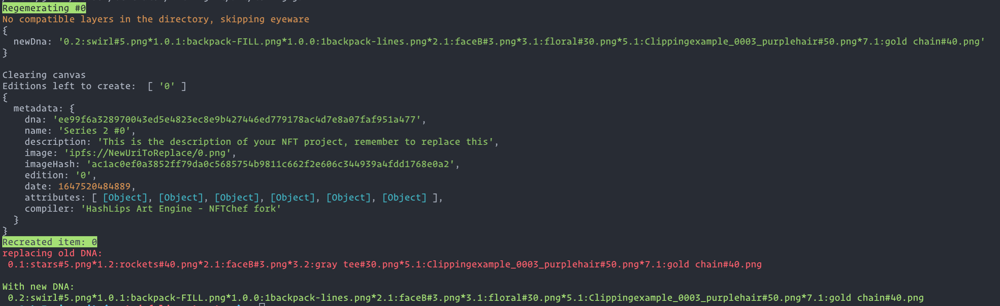

# Regenerate

Usage: `node utils/regenerate.js [options] <id>`

Options: `-d, --debug` display some debugging


In the event that the generator outputs a small number of images that you do not like and you would like to _try again_, the `regenerate` utility will take all previously used \_dna into consideration and run the generator once to output a new image and metadata.

⚠️ This script modifies the `_dna.json` file used in a number of other utility scripts. After modifying `_dna.json` with this regenration script, you will lose the dna data for the item you are replacing. This is permanent.&#x20;

### Example

To regenerate/recreate item number 1, which will:\
Replace: `build/images/1.png` + \`build/json/1.json\`\
Modify: `build/json/_metadata.json` _+ `build/_dna.json`_\
_``_

```
node utils/regenerate.js -d 1
```



